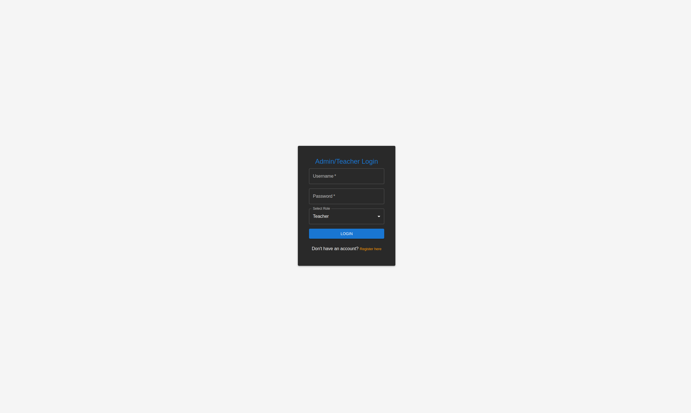
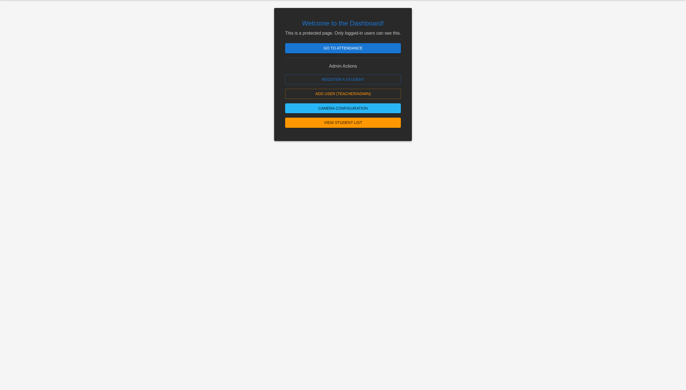
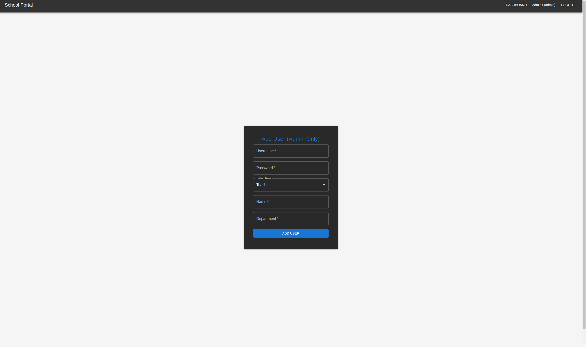
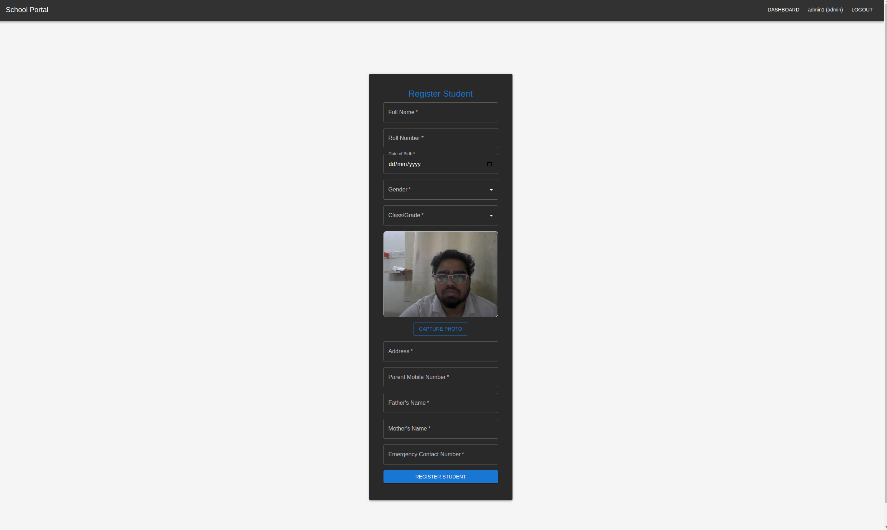
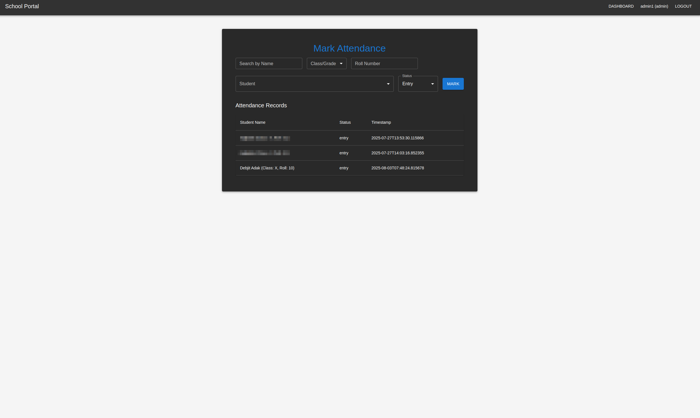
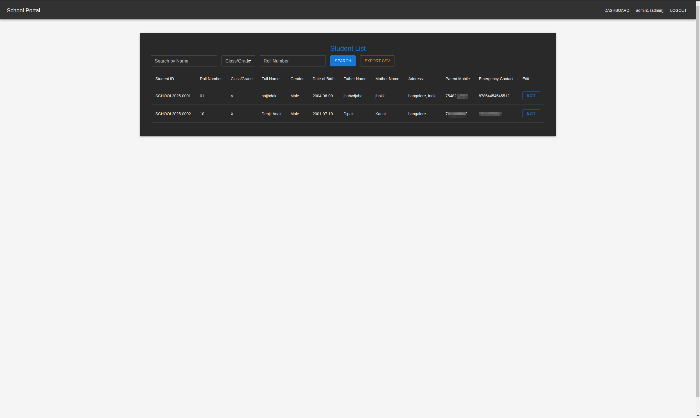
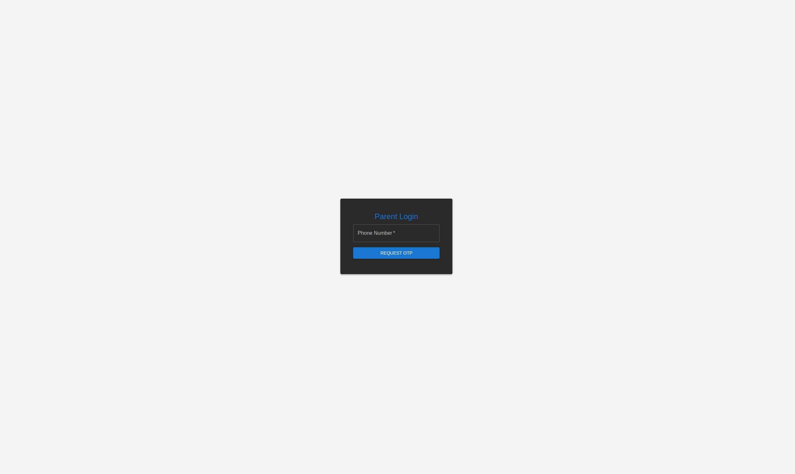
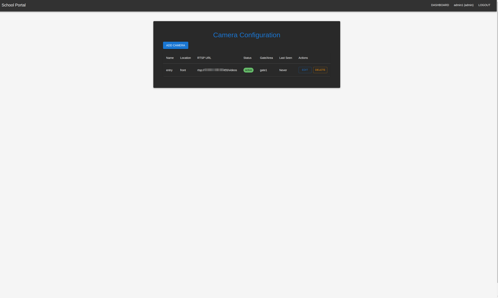

# 🎓 School Face Recognition Attendance System

A scalable, production-ready system for real-time student attendance using DeepStream, Milvus, FastAPI, and a modern React UI.

---

## 🚀 Project Overview

This system provides real-time, AI-powered student attendance using face recognition.  
It is designed for scalability, security, and ease of use in schools, colleges, and enterprises.

- **Face recognition is performed on-premises (DeepStream) for privacy and speed.**
- **All student, camera, and attendance management is done via a modern web UI.**
- **Embeddings are stored and searched in Milvus for fast, accurate matching.**
- **Admin can review, confirm, or reject attendance and unknown faces.**

---

## 🏗️ Architecture

```
[React UI] <--> [FastAPI Backend] <--> [PostgreSQL, Milvus]
      ^                ^
      |                |
      v                v
[DeepStream Docker] <--> [Camera Streams]
```

- **UI:** Student/camera/attendance management, admin review
- **Backend:** API, embedding generation, Milvus integration
- **Milvus:** Vector DB for face embeddings
- **DeepStream:** Real-time face detection, embedding, and event sync

---

## ✨ Features

- Student registration with photo, unique ID, and all metadata
- Camera management (add/edit/delete, config sync)
- DeepStream pipeline for multi-camera face detection and embedding extraction
- Milvus vector search for fast face matching
- Real-time attendance event sync and admin confirmation
- Unknown face review and admin labeling
- JWT authentication and role-based access
- Modern, responsive UI (Material-UI)
- Dockerized for easy deployment

---

## 🖼️ Screenshots

| Login Page | Admin Dashboard |
|------------|----------------|
|  |  |

| Add Teacher/Admin | Student Registration | Attendance Page |
|------------------|----------------------|----------------|
|  |  |  |

| Student List | Parent Login | Camera Config |
|--------------|-------------|--------------|
|  |  |  |

---

## ⚡ Quick Start

1. **Clone the repo and install dependencies.**
2. **Start PostgreSQL, Milvus, and DeepStream containers.**
3. **Run backend and frontend.**
4. **Register the first admin and log in.**
5. **Add cameras and students.**
6. **Start DeepStream pipeline and see real-time attendance!**

---

## 🛠️ Setup

### 1. Clone the Repository
```bash
git clone https://github.com/debjit721212/Student_attendence_managment.git
cd Student_attendence_managment
```

### 2. Backend Setup
```bash
pip install -r requirements.txt
alembic upgrade head
```
- Set up Milvus (see [Milvus docs](https://milvus.io/docs/install_standalone-docker.md)).

### 3. Frontend Setup
```bash
cd frontend
npm install
```
- Set API URL in `.env`:
  ```
  REACT_APP_API_URL=http://localhost:8000
  ```

### 4. DeepStream Setup
- Build and run your DeepStream Docker container.
- Make sure it can access the backend and Milvus.

---

## ▶️ Running the System

- **Start backend:**  
  ```bash
  uvicorn app.main:app --host 0.0.0.0 --port 8000 --reload
  ```
- **Start frontend:**  
  ```bash
  npm start
  ```
- **Start Milvus:**  
  ```bash
  docker compose up -d
  ```
- **Start DeepStream pipeline:**  
  ```bash
  python3 pipeline.py
  ```

---

## 🔗 API Endpoints

<details>
<summary><b>Click to expand full API list</b></summary>

### **Authentication**
- `POST /auth/register` — Register first admin
- `POST /auth/login` — Login (admin/teacher)

### **User Management**
- `POST /admin/add-user` — Add user (admin only)
- `GET /admin/list` — List admins (testing only)
- `POST /admin/reset-password` — Reset admin password (testing only)

### **Student Management**
- `POST /students/register` — Register student
- `GET /students/list` — List students (with filters)
- `PUT /students/{student_id}` — Update student
- `GET /students/export` — Export students to CSV

### **Attendance**
- `POST /attendance/mark` — Mark attendance (DeepStream event)
- `GET /attendance/list` — List attendance records
- `GET /attendance/pending` — List pending events
- `POST /attendance/confirm/{event_id}` — Confirm event
- `POST /attendance/reject/{event_id}` — Reject event

### **Unknown Face Review**
- `POST /unknown-faces/` — Add unknown face event
- `GET /unknown-faces/` — List unknown faces
- `POST /unknown-faces/label/{event_id}` — Label unknown face
- `DELETE /unknown-faces/{event_id}` — Delete unknown face

### **Camera Management**
- `GET /cameras/` — List cameras
- `POST /cameras/` — Add camera
- `PUT /cameras/{camera_id}` — Update camera
- `DELETE /cameras/{camera_id}` — Delete camera

</details>

---

## 📖 Usage Guide

- **Register First Admin:**  
  Go to `/register` in the UI or use `/auth/register` in Swagger UI.
- **Add Cameras:**  
  Use the CameraConfig page in the UI to add/edit/delete cameras.
- **Register Students:**  
  Use the student registration page in the UI, upload a photo, and fill in all metadata.
- **Mark Attendance:**  
  DeepStream will automatically send attendance events when a face is matched.
- **Admin Review:**  
  Go to the Attendance Review page to confirm/reject events.  
  Go to the Unknown Face Review page to label or register unknown faces.

---

## 🛡️ Security & Best Practices

- All protected endpoints require a JWT token in the `Authorization` header.
- Only admin can add users, cameras, or confirm/reject attendance.
- Passwords are hashed using bcrypt.
- CORS is enabled for secure frontend-backend communication.
- Use HTTPS in production for all API calls.
- Remove or protect any testing/admin endpoints in production.

---

## 🧩 Data Model

<details>
<summary><b>Click to expand data model</b></summary>

### **Student**
| Field         | Type    | Description           |
|---------------|---------|-----------------------|
| student_id    | String  | Unique global ID      |
| name          | String  | Full name             |
| photo         | String  | Path to photo         |
| ...           | ...     | ...                   |

### **Attendance**
| Field         | Type    | Description           |
|---------------|---------|-----------------------|
| id            | Integer | Primary key           |
| student_id    | String  | Student global ID     |
| status        | String  | entry/exit/pending    |
| date          | Date    | Date of event         |
| ...           | ...     | ...                   |

### **UnknownFace**
| Field         | Type    | Description           |
|---------------|---------|-----------------------|
| id            | Integer | Primary key           |
| camera_id     | String  | Camera ID             |
| timestamp     | DateTime| When detected         |
| image_path    | String  | Path to face image    |
| label         | String  | Labeled by admin      |

</details>

---

## 🛠️ Troubleshooting

- **Cannot connect to backend:**  
  - Make sure backend is running on `0.0.0.0:8000` and accessible from other containers.
- **Milvus errors:**  
  - Make sure collection is created, indexed, and loaded.
- **Registration/login issues:**  
  - Check backend logs for error messages.
- **DeepStream not sending events:**  
  - Check network connectivity and JWT token.

---

## 💡 FAQ

**Q: How do I reset the admin password?**  
A: Use the `/admin/reset-password` endpoint (for testing only).

**Q: How do I add a new camera?**  
A: Use the CameraConfig page in the UI or the `/cameras/` endpoint.

**Q: What if Milvus gives an "index not found" error?**  
A: Make sure you create and load the index after creating the collection.

---

## 🚀 Deployment

- Use Docker Compose to run all services (backend, frontend, Milvus, DeepStream).
- Set all secrets and config via environment variables.
- Use HTTPS and secure JWT tokens in production.
- Regularly backup your PostgreSQL and Milvus data.

---

## 🤝 Contributing

- Fork the repo, create a feature branch, and submit a pull request.
- Please write tests and update documentation for new features.

---

## 📝 Changelog

### v1.0.0
- Initial release: student registration, camera management, DeepStream integration, Milvus search, admin review UI.

---

## 📄 License

MIT License